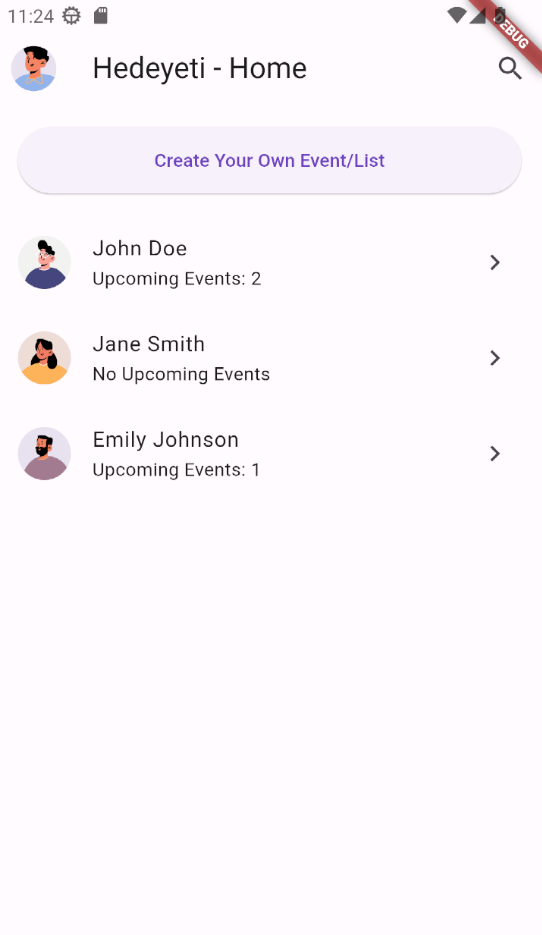
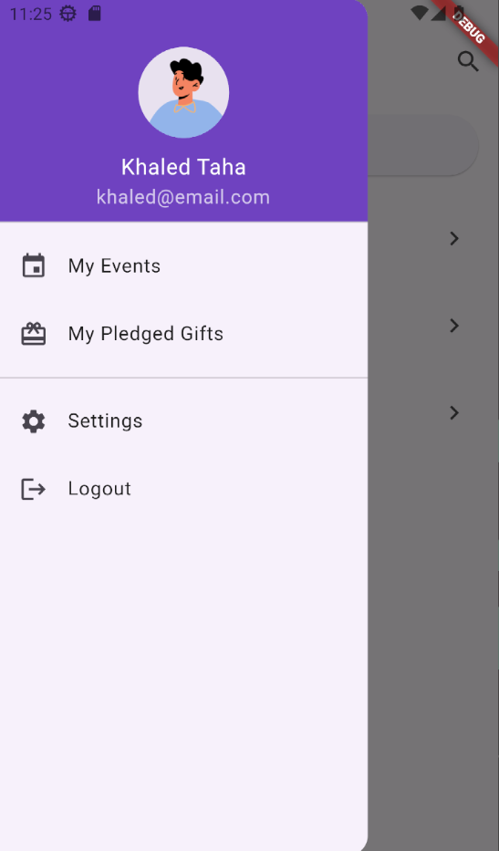
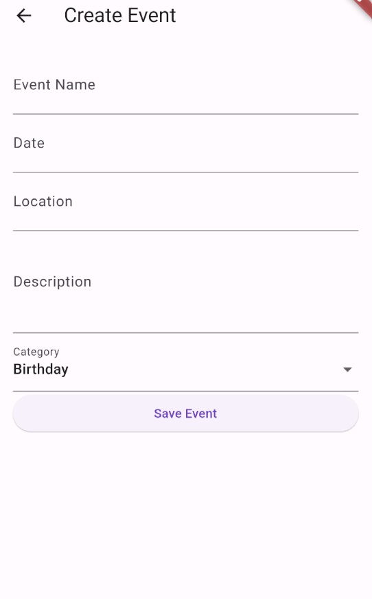
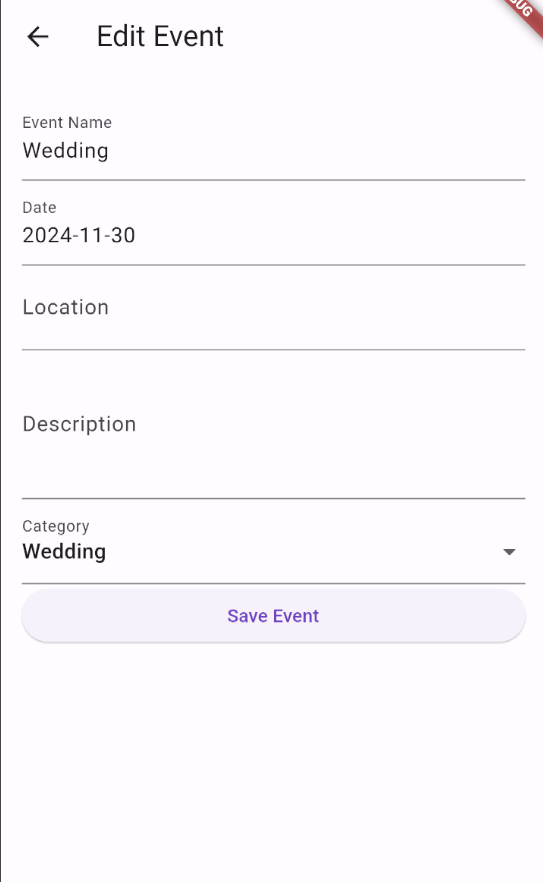
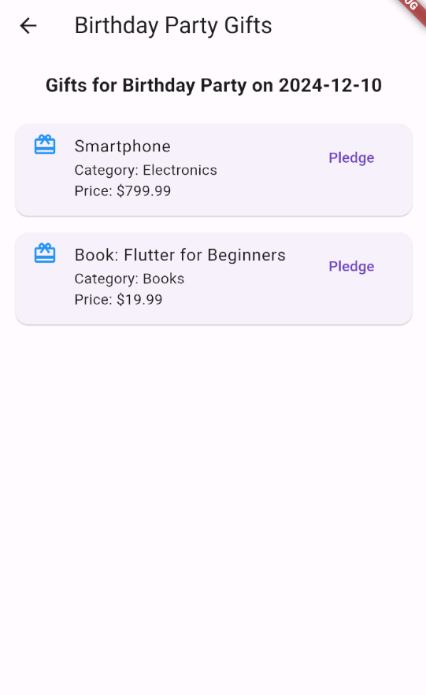
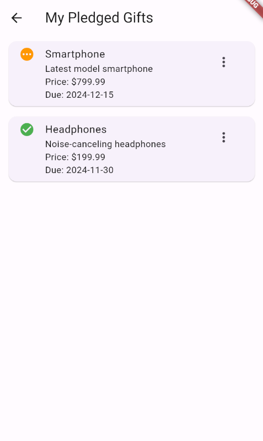

# Hedeyeti

**Hedeyeti** is a gift list management app built with Flutter. The app simplifies the process of creating, managing, and sharing wish lists for special occasions such as birthdays, weddings, engagements, graduations, and holidays.

---

## Features

1. **User-Friendly UI**:
   - Manage friends and their gift lists.
   - Create and manage events and gift lists.
   - Real-time updates for pledged gifts.

2. **Local and Cloud Storage**:
   - SQLite for local data persistence.
   - Firebase for real-time database sync and user authentication.

3. **Barcode Scanner**:
   - Easily add gifts by scanning barcodes.

4. **Notifications**:
   - Get notified when a friend pledges to buy a gift.

5. **Clean Architecture**:
   - Follows best practices for code organization and maintainability.

---

## Screenshots

### Home Page


### My Profile (App Drawer)


### Create Event


### Edit Event


### Friend Events


### Gift List for Event


### My Pledged Gifts


### Delete Event Popup


### Example Users


---

## Technology Stack

- **Frontend**: Flutter (Dart)
- **Database**:
  - SQLite (Local storage)
  - Firebase Realtime Database (Cloud sync)
- **Authentication**: Firebase Authentication
- **Notifications**: Firebase Cloud Messaging
- **Barcode Scanning**: `flutter_barcode_scanner` plugin

---

## Setup Instructions

### Prerequisites
1. Flutter SDK installed. ([Installation Guide](https://docs.flutter.dev/get-started/install))
2. Firebase project set up. ([Firebase Setup Guide](https://firebase.google.com/docs/flutter/setup))
3. Git installed.

### Steps to Run Locally
1. Clone the repository:
   ```bash
   git clone https://github.com/your-username/hedieaty.git
   cd hedieaty
   ```
2. Install dependencies:
   ```bash
   flutter pub get
   ```
3. Configure Firebase:
   - Add your `google-services.json` (Android) and `GoogleService-Info.plist` (iOS) files to the appropriate directories.
4. Run the app:
   ```bash
   flutter run
   ```

---

## Project Structure

```plaintext
lib/
├── main.dart                # Entry point of the app
├── models/                  # Data models (User, Event, Gift, etc.)
├── services/                # Firebase and local database services
├── views/                   # UI pages (HomePage, EventListPage, etc.)
├── widgets/                 # Reusable widgets
└── utils/                   # Helper functions and constants
```

---

## Milestones

### Milestone 1: UI Layout Design
- Complete the design of all pages:
  - Home Page
  - Event List Page
  - Gift List Page
  - Gift Details Page
  - Profile Page
  - My Pledged Gifts Page

### Milestone 2: Navigation and Database Integration
- Implement navigation between pages.
- Add SQLite integration for local data storage.
- Sync with Firebase Realtime Database.

### Final Delivery:
- Full-featured app with all functionalities.
- Real-time updates and notifications.
- Test suite with automated testing scripts.

---

## Testing

### Test Suite
- Unit tests for critical app functions.
- Integration tests for workflows.
- Automated scripts for running test cases.

### Run Tests
1. Run unit and integration tests:
   ```bash
   flutter test
   ```
2. Execute automated scripts:
   - Windows: Run `run-tests.ps1`
   - Linux: Run `run-tests.sh`

---

## Contribution Guidelines

1. Fork the repository.
2. Create a feature branch:
   ```bash
   git checkout -b feature-name
   ```
3. Commit changes:
   ```bash
   git commit -m "Description of changes"
   ```
4. Push the branch and create a pull request.

---

## License

© Khaled Taha, 2024. All Rights Reserved.  
This project is proprietary and should not be shared without permission.

---

## Contact

For inquiries or support, contact [kmhtaha@gmail.com].
